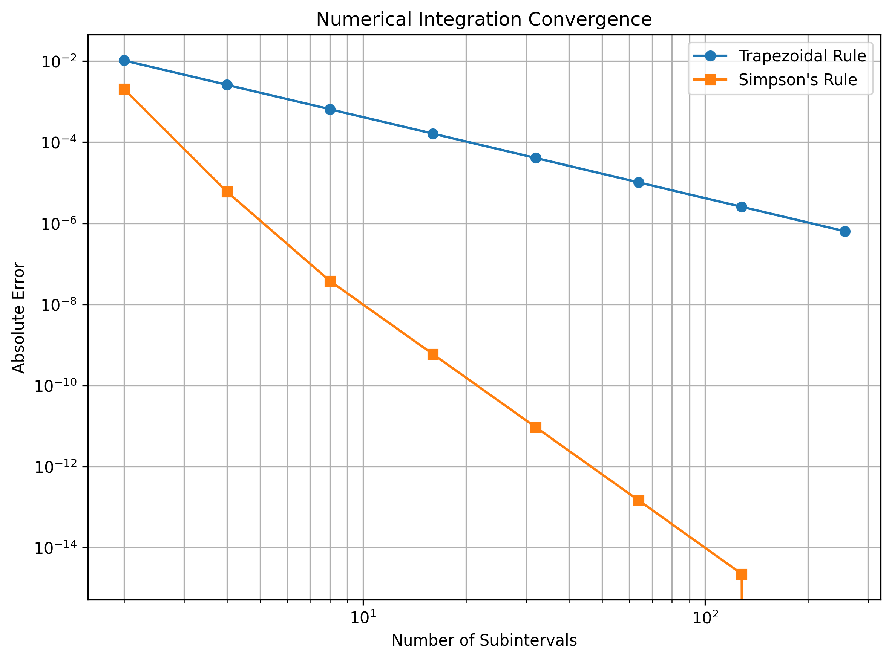
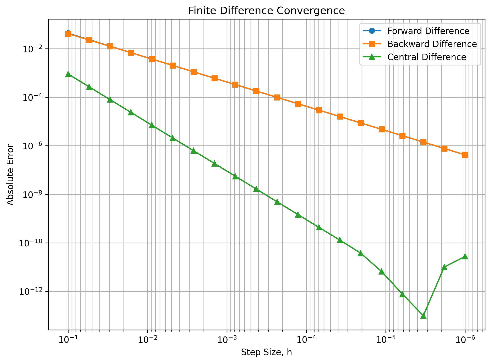
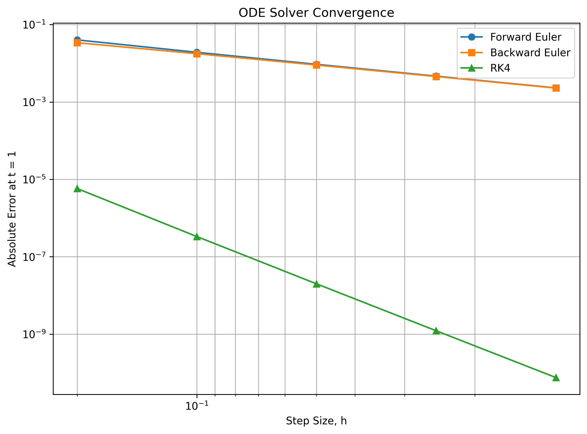
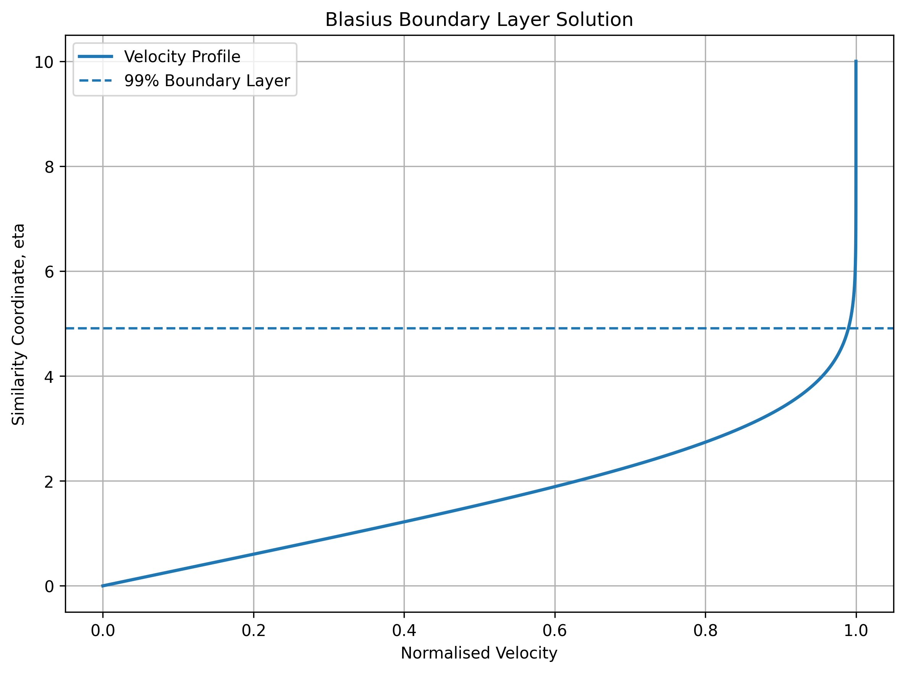
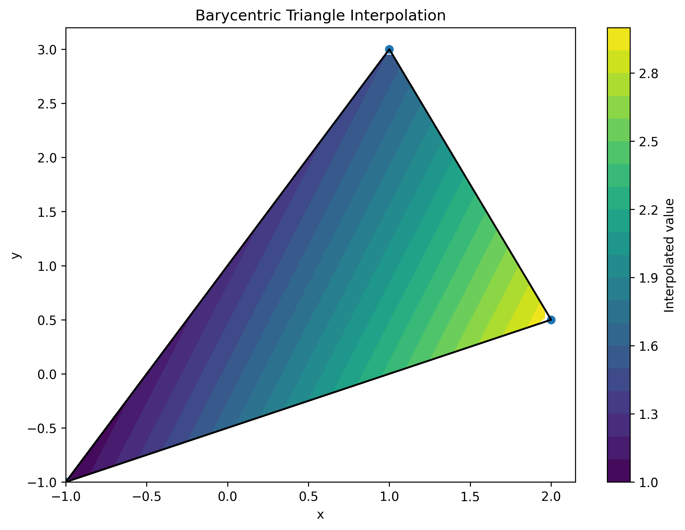
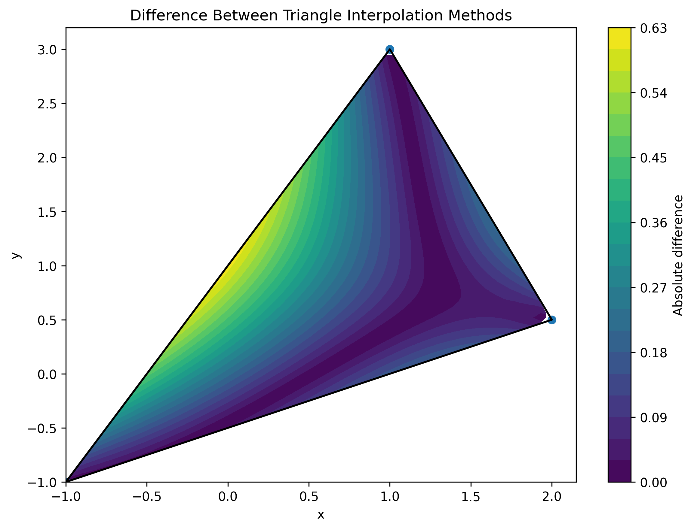

# Numerical Methods for Engineering Analysis

A Python library implementing and verifying numerical methods commonly used in engineering analysis.

The repository brings together numerical techniques for interpolation, differentiation, integration, ordinary differential equations, boundary-value problems, and nonlinear root finding. The methods are implemented directly in Python and NumPy, with engineering examples and analytical comparisons used to assess their accuracy and behaviour.

# Methods Implemented

**Numerical Integration**

- Trapezoidal rule
- Simpson's rule
- Adaptive Simpson integration
- Gauss-Legendre quadrature
- Double integration using repeated trapezoidal integration

**Numerical Differentiation**

- Forward difference
- Backward difference
- Central difference
- Higher-order forward derivatives
- Higher-order backward derivatives

**Interpolation and Linear Systems**

- Lagrange interpolation
- Newton divided differences
- Newton interpolation
- Cubic spline interpolation
- Bilinear interpolation
- Barycentric-coordinate interpolation over triangular elements
- Inverse-distance interpolation over triangular elements
- Gaussian elimination with partial pivoting

**Ordinary Differential Equations**

Initial-value problems:

- Forward Euler method
- Backward Euler method
- Fourth-order Runge-Kutta method
- Systems of coupled ODEs

Boundary-value problems:

- Finite-difference method with Dirichlet boundary conditions
- Finite-difference method with Robin boundary conditions
- Shooting method using secant iteration

**Root Finding**

- Bisection method
- Newton-Raphson method
- Newton's method for systems of nonlinear equations
- Numerical Jacobian using central finite differences

# Engineering Examples

**Integration**

- Convergence comparison of trapezoidal and Simpson's rules
- Aerofoil volume calculation from discrete surface data
- Numerical estimation of the volume of an ellipsoidal dome using double integration

**Differentiation**

- Convergence of forward, backward, and central finite differences
- Rocket acceleration calculated from discrete velocity data

**Interpolation**

- Polynomial interpolation and comparison of polynomial orders
- Runge phenomenon
- Cubic spline interpolation
- Bilinear image interpolation
- Barycentric interpolation over a two-dimensional triangular element
- Inverse-distance interpolation over a two-dimensional triangular element
- Comparison of barycentric and inverse-distance interpolation across a triangle

**Ordinary Differential Equations**

- Convergence comparison of Forward Euler, Backward Euler, and RK4
- Coupled three-mass spring system
- Nonlinear double pendulum
- Heat transfer through nuclear fuel rod cladding
- Blasius boundary-layer equation solved using a shooting method

**Root Finding**

- Comparison of bisection and Newton-Raphson methods for a nonlinear equation

# Results

Selected results demonstrating numerical convergence and engineering applications.

**Numerical Integration Convergence**



Comparison of the absolute error of the composite trapezoidal and Simpson's rules under progressive grid refinement.

**Numerical Differentiation Convergence**



Convergence comparison of forward, backward, and central finite-difference approximations.

**ODE Solver Convergence**



Error comparison of Forward Euler, Backward Euler, and fourth-order Runge-Kutta methods as the time step is refined.

**Blasius Boundary-Layer Solution**



Numerical solution of the Blasius boundary-layer equation using a shooting method with RK4 integration and secant iteration.

**Barycentric Triangle Interpolation**



Interpolation of nodal values across a two-dimensional triangular element using barycentric coordinates.

**Triangle Interpolation Method Comparison**



Absolute difference between barycentric-coordinate and inverse-distance interpolation across the same triangular element.

# Verification

Where possible, numerical results are compared against analytical solutions or known reference values.

The repository includes automated unit tests covering the core numerical methods. Tests assess numerical accuracy, input validation, boundary conditions, convergence behaviour, and error handling.

The triangular interpolation implementation is additionally verified using properties of barycentric coordinates, including reproduction of a linear field and exact recovery of values at triangle vertices. Degenerate triangular elements are detected and rejected.

Run the complete test suite using:

```bash
python -m unittest discover -v
```

# Repository Structure

```text
Numerical-Methods/
├── integration/
│   ├── __init__.py
│   └── integration.py
├── differentiation/
│   ├── __init__.py
│   └── differentiation.py
├── interpolation/
│   ├── __init__.py
│   ├── interpolation.py
│   └── triangle_interpolation.py
├── ode/
│   ├── __init__.py
│   ├── initial_value.py
│   └── boundary_value.py
├── root_finding/
│   ├── __init__.py
│   └── root_finding.py
├── examples/
│   ├── ...
│   └── triangle_interpolation_comparison.py
├── tests/
│   ├── ...
│   └── test_triangle_interpolation.py
├── data/
├── outputs/
├── README.md
├── requirements.txt
├── LICENSE
└── .gitignore
```

# Example Usage

The numerical methods are written as reusable functions that can be imported into other Python programs.

For example, Simpson's rule can be used to integrate discrete data:

```python
import numpy as np

from integration.integration import simpson_rule

x = np.linspace(0.0, 1.0, 101)
y = x**2

integral = simpson_rule(x, y)

print(integral)
```

The analytical value is:

```text
1/3 = 0.333333...
```

Barycentric interpolation can similarly be used to interpolate a value within a triangular element:

```python
import numpy as np

from interpolation.triangle_interpolation import barycentric_interpolation

vertices = np.array([[0.0, 0.0], [1.0, 0.0], [0.0, 1.0]])
values = np.array([1.0, 2.0, 3.0])
point = np.array([0.25, 0.25])

interpolated_value = barycentric_interpolation(vertices, values, point)

print(interpolated_value)
```

Individual engineering examples can be run directly from the repository root:

```bash
python -m examples.integration_convergence
python -m examples.coupled_spring_mass
python -m examples.blasius_shooting
python -m examples.root_finding_comparison
python -m examples.triangle_interpolation_comparison
```

# Dependencies

- Python
- NumPy
- Matplotlib

Install the required packages using:

```bash
pip install -r requirements.txt
```

# Purpose

This repository was developed to consolidate numerical methods used throughout engineering analysis into a structured and reusable Python codebase.

The focus is not only on implementing each numerical technique, but also on understanding its numerical behaviour through verification, convergence studies, and engineering applications.